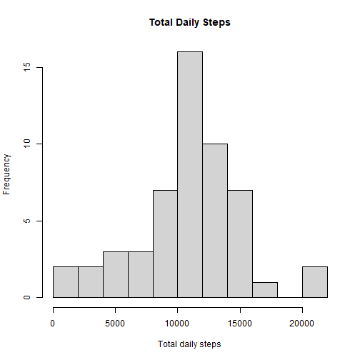
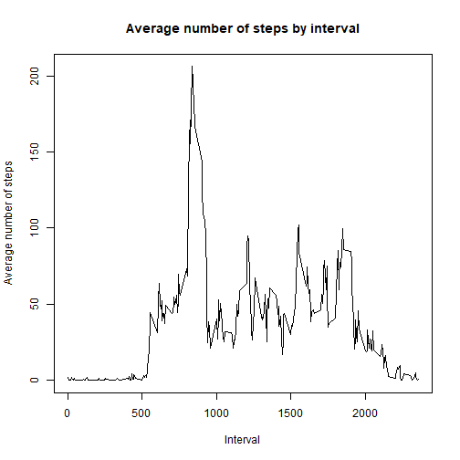
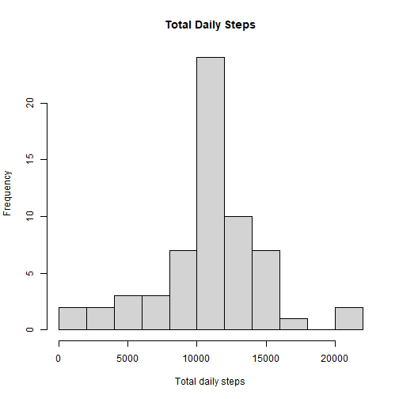
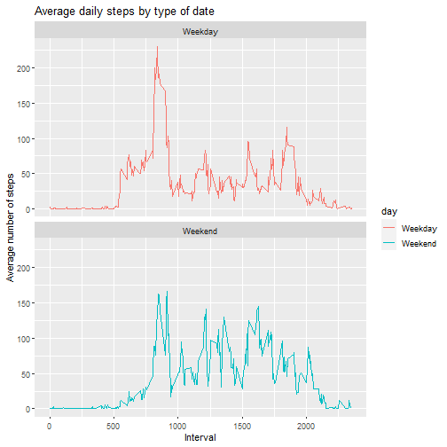

## Loading and preprocessing the data

```r
if(!require(tidyverse)){
    install.packages("tidyverse")
    library(tidyverse)
}
df = read.csv(unz('activity.zip','activity.csv'))
```


## What is mean total number of steps taken per day?


```r
df_daily = df %>% group_by(date) %>% summarize(daily_steps = sum(steps))
```

```
## `summarise()` ungrouping output (override with `.groups` argument)
```

```r
hist(df_daily$daily_steps, main = "Total Daily Steps", xlab = "Total daily steps", ylab = "Frequency", breaks = 10)
```




```r
step_moments = df_daily %>% summarize(mean_daily_steps = mean(daily_steps, na.rm = TRUE), median_daily_steps = median(daily_steps, na.rm = TRUE))
step_moments
```

```
## # A tibble: 1 x 2
##   mean_daily_steps median_daily_steps
##              <dbl>              <int>
## 1           10766.              10765
```


## What is the average daily activity pattern?

```r
df_interval = df %>% group_by(interval) %>% summarize(mean_steps = mean(steps, na.rm = TRUE))
```

```
## `summarise()` ungrouping output (override with `.groups` argument)
```

```r
plot(df_interval$interval, df_interval$mean_steps, type = 'l', main = "Average number of steps by interval", xlab = "Interval", ylab = "Average number of steps")
```




```r
df_interval[which.max(df_interval$mean_steps), ]$interval
```

```
## [1] 835
```

## Imputing missing values

```r
sum(is.na(df$steps))
```

```
## [1] 2304
```


```r
imputations = df_interval$mean_steps[match(df$interval, df_interval$interval)]
df_imputed = transform(df, steps = ifelse(is.na(df$steps), yes = imputations, no = df$steps))
```


```r
df_daily_imputed = df_imputed %>% group_by(date) %>% summarize(daily_steps = sum(steps))
```

```
## `summarise()` ungrouping output (override with `.groups` argument)
```

```r
hist(df_daily_imputed$daily_steps, main = "Total Daily Steps", xlab = "Total daily steps", ylab = "Frequency", breaks = 10)
```




```r
step_moments_imputed = df_daily_imputed %>% summarize(mean_daily_steps = mean(daily_steps, na.rm = TRUE), median_daily_steps = median(daily_steps, na.rm = TRUE))
step_moments_imputed
```

```
## # A tibble: 1 x 2
##   mean_daily_steps median_daily_steps
##              <dbl>              <dbl>
## 1           10766.             10766.
```


## Are there differences in activity patterns between weekdays and weekends?

```r
df_imputed$date = as.Date(strptime(df_imputed$date, format="%Y-%m-%d"))
df_imputed$day = sapply(df_imputed$date, function(x) {
        if (weekdays(x) == "Samstag" | weekdays(x) =="Sonntag") 
          {y = "Weekend"} else 
          {y = "Weekday"}
        y
        })
```


```r
unique(weekdays(df_imputed$date))
```

```
## [1] "Montag"     "Dienstag"   "Mittwoch"   "Donnerstag" "Freitag"   
## [6] "Samstag"    "Sonntag"
```


```r
df_by_day = df_imputed %>% group_by(interval, day) %>% summarize(steps = mean(steps, na.rm = TRUE))
```

```
## `summarise()` regrouping output by 'interval' (override with `.groups` argument)
```

```r
plot<- ggplot(df_by_day, aes(x = interval , y = steps, color = day)) +
       geom_line() +
       labs(title = "Average daily steps by type of date", x = "Interval", y = "Average number of steps") +
       facet_wrap(~day, ncol = 1, nrow=2)
print(plot)
```




